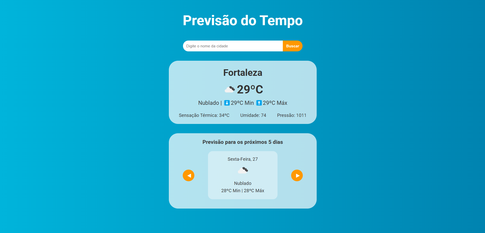

<h1>🌦️ Weather Forecast Project</h1>

Confira em: <a href="https://regisazevedoo.github.io/Previsao-do-Tempo/" target="_blank">regisazevedoo.github.io/Previsao-do-Tempo/</a>

Este projeto é uma ferramenta de consulta meteorológica que fornece dados precisos de cidades ao redor do mundo. A interface adapta-se visualmente conforme o clima pesquisado.

<h2>Principais capturas de dados:</h2>

Condições atuais: céu limpo, chuva, nuvens.

Medições térmicas: temperatura atual, mínima, máxima.

Dados atmosféricos: umidade, pressão.
 

<h2>Ferramentas utilizadas:</h2>

Interface: Javascript, React, HTML5, CSS3, Flexbox.

Dados: Fetch API.

Serviço de Clima: OpenWeatherMap.